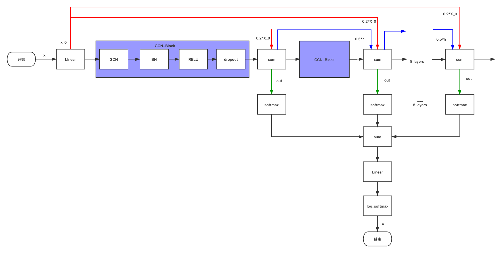

# ogbn_arxiv_GCN_res
This is an improvement of baesline on the ogbn-arxiv dataset.

### ogbn-arxiv

The framework is shown in the figure.



#### Improvement Strategy：

+ add skip-connection inspired by DeeperGCN
+ add initial residual connection inspired by GCNII
+ add jumping knowledge inspired by JKNet

#### Environmental Requirements

+ pytorch >= 1.6.0
+ pytorch_geometric >= 1.6.0
+ ogb >= 1.2.4

#### Experiment Setup：

The model is 8 layers, and runs 500 epochs.

```bash
python ogbn_gcn_res.py
```

#### Detailed Hyperparameter:

```bash
num_layers = 8
hidden_dim = 128
dropout = 0.5
lr = 0.01
runs = 10
epochs = 500
alpha = 0.2
beta = 0.5
```

#### Result:

```bash
All runs:
Highest Train: 77.94 ± 0.50
Highest Valid: 73.69 ± 0.21
  Final Train: 77.72 ± 0.46
   Final Test: 72.62 ± 0.37
```

| Model   | Test Accuracy   | Valid Accuracy  | Parameters | Hardware         |
| ------- | --------------- | --------------- | ---------- | ---------------- |
| GCN_res | 0.7262 ± 0.0037 | 0.7369 ± 0.0021 | 155824     | Tesla T4（16GB） |

